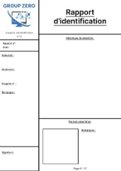

  
  Notice d’utilisation Suspect authentificateur V1.0  

 

  
  1. Aller sur le script test.py qui se situe dans le dossier app 

  
  Notice d’utilisation Suspect authentificateur V1.0  

  
  Notice d’utilisation Suspect authentificateur V1.0  

  
  Notice d’utilisation Suspect authentificateur V1.0  

  
  Notice d’utilisation Suspect authentificateur V1.0  

  1. Ouvrir le fichier script.py avec VSCode par exemple. 

  1. Une fenêtre s’ouvre

  1. Exécuter le fichier script.py en cliquant sur le bouton en haut a droite (bien vérifier que l’on se situe bien dans ce dossier quand on l’exécute)

  Rentrer les donner de l’auteur, de la victime et ne numéro d’enquête dans la fenêtre qui vient de s’ouvrir fenêtre apparait : 
Cliquer sur valider quand c’est fini

  Une nouvelle fenêtre s’ouvre avec 6 images proposer. (Remplacer le screen)
1. Sélectionner entre une à six images qui ressemble le plus à la victime, de la plus à la moins ressemblante
1. Cliquer sur le bouton next 

  Si l’on s’est trompé, l’on peut revenir en arrière en cliquant sur l’historique si situant à gauche

1. Une fois que l’on pense que le portrait-robot ressemble le plus à notre victime, sélectionner une image et appuyer sur validation finale : 

  Un fichier police.pdf a été créé. Il s’agit du rapport d’identification

  À la fin, le fichier obtenu ressemblera est celui-ci.
