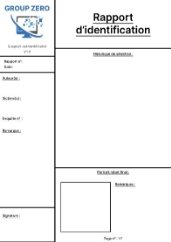

 
# Notice d’utilisation Suspect authentificateur V1.0 
  

 1. Aller sur le script test.py qui se situe dans le dossier app 
  

 2. Ouvrir le fichier script.py avec VSCode par exemple. 
  

 3. Une fenêtre s’ouvre
  

 4. Exécuter le fichier script.py en cliquant sur le bouton en haut a droite (bien vérifier que l’on se situe bien dans ce dossier quand on l’exécute)
  

 5. Entrer les donner de l’auteur, de la victime et ne numéro d’enquête dans la fenêtre qui vient de s’ouvrir fenêtre apparait  
 6. Cliquer sur valider quand c’est fini
  

 Une nouvelle fenêtre s’ouvre avec 6 images proposer. (Remplacer le screen) 
 7. Sélectionner entre une à six images qui ressemble le plus à la victime, de la plus à la moins ressemblante 
 8. Cliquer sur le bouton next 
  

 9. Si l’on s’est trompé, l’on peut revenir en arrière en cliquant sur l’historique si situant à gauche  
 10. Une fois que l’on pense que le portrait-robot ressemble le plus à notre victime, sélectionner une image et appuyer sur validation finale : 
  

 11. Un fichier police.pdf a été créé. Il s’agit du rapport d’identification
  

 12. À la fin, le fichier obtenu ressemblera est celui-ci.
 

